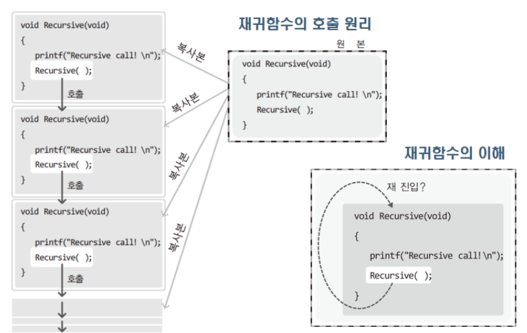

### 재귀 함수
- 함수 내에서 자기 자신을 다시 호출하는 함수



```c
void Recursive(void)
{
	printf("Recursive call! \n");
	Recursive();
}
```
- 함수를 구성하는 명령문은 cpu로 복사되어 다시 실행됨
- 함수를 완료하지 않은 상태에서 다시 **Recursive**함수를 호출하는 것은 문제가 되지 않는다.

#### 자료구조나 알고리즘의 어려운 문제를 단순화하는데 사용되는 중요한 도구

### 피보나치 수열 

#### fibonacchi(n)
- **n = 1 ==> 0**
- **n = 2 ==> 1**
...
- **otherwise** ==> **fib(n-1) + fib(n-2)**