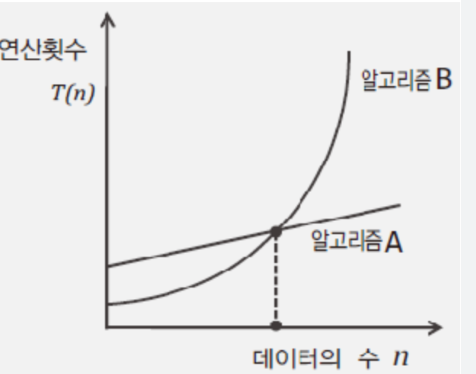
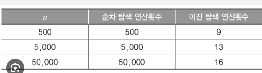

## 알고리즘 평가 요소

### 시간복잡도
- 어떤 알고리즘이 어떠한 상황에서 더 빠르나?

#### 중요한 건 데이터 수가 많아짐에 따라 연산 횟수의 증가 정도
- 연산의 횟수를 센다.
- 처리해야 할 데이터 수 n에 대한 연산횟수의 함수T(n)를 구성

	- 상황에 따라 다르겠지만 대체로 알고리즘 A가 훨씬 좋은 알고리즘
	- 데이터 수가 적을 때는 B가 더 성능이 좋지만 애초에 데이터가 적을때는 차이가 얼마 나지도 않음

#### 순차 탐색 알고리즘의 시간 복잡도 계산 ==> 항상 최악의 경우로 계산
**데이터의 수가 n개일 때, 최악의 경우에 해당하는 연산횟수는 n이다. 즉, T(n) = n**

### 공간복잡도
어떤 알고리즘이 어떠한 상황에서 메모리를 더 적게 쓰나?

## big-O 표기법
- 알고리즘에서 T(n)식이 다항식으로 구성된 경우 최고차항의 차수가 빅-오가 된다.
- 빅오 표기법은 데이터 수 증감율을 따지는 표기법이므로 최고차항을 제외한 식은 제외해도 증감율에는 아무런 영향이 없다.

### 순차 탐색 알고리즙과 이진 탐색 알고리즘 비교

- BSWorstOpCount.c 소스코드 참고
#### 이진 탐색 알고리즘이 압도적으로 효율이 좋다.