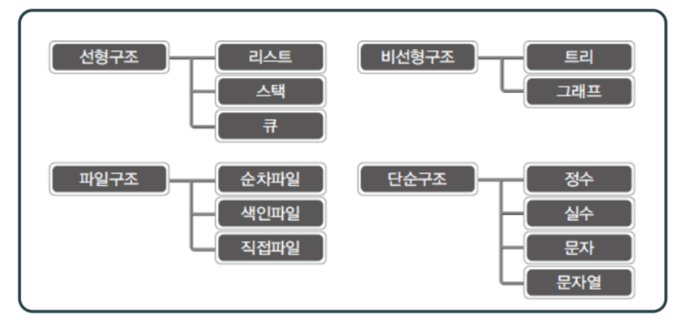

### 사전지식
- 구조체를 정의할 줄 알고 구조체 대상으로 typedef 선언을 할줄 알아야 함
- 메모리 동적 할당을 이해하고 이와 연관된 malloc 함수와 free 함수를 사용할 줄 알아야 함
- 포인터 변수 선언과 포인터 연산에 부담이 없다.
- 헤더파일이 필요한 이유를 이해
- 헤더파일을 정의할 줄 알고 헤더파일에 들어가야 할 것들이 무엇인지 알고 있다.
- 헤더파일의 정의에 사용되는 기본적인 매크로를 알고있다.
- 하나의 프로그램을 둘 이상의 소스파일과 헤더파일에 나누어 담을 줄 안다.
- 재귀함수의 동작방식을 안다... 그리고 재귀함수와 관련된 아주 간단한 예제는 분석할 수 있다. 

### 자료구조란?
- 데이터를 표현하고 저장하는 방법

#### 선형 자료구조
데이터를 선의 형태로 나란히 혹은 일렬로 저장하는 방식
#### 비선형 자료구조
데이터를 나란히 저장하지 않는 구조